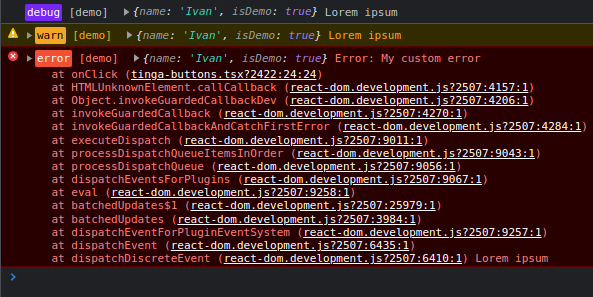

# Tinga

Small browser logging module with the ability to send logs to the remote endpoint

[](https://github.com/ivandotv/tinga/actions/workflows/CI.yml)
[](https://app.codecov.io/gh/ivandotv/tinga)
[](https://github.com/ivandotv/tinga/blob/main/LICENSE)

Small ([~1KB](https://bundlephobia.com/package/tinga)) logging module primarily for the browser. It has a few logging levels that can be enabled and disabled at runtime. It also can automatically send the logs to a remote server (by default it uses `navigator.sendBeacon`).



<!-- toc -->

- [Install](#install)
- [Motivation](#motivation)
- [Usage](#usage)
- [Configuration](#configuration)
  - [Context](#context)
  - [Levels](#levels)
  - [Remote Configuration](#remote-configuration)
  - [Child instances](#child-instances)
  - [Examples](#examples)

<!-- tocstop -->

## Install

`npm i tinga`

## Motivation

While [pino](https://github.com/pinojs/pino) is an excellent logger for the backend all the functionality is not needed for the frontend, it has a bigger file size, and the default formatting doesn't suit the browser console hence, `Tinga` has been created.

## Usage

Usage is very simple, by default you don't need to pass in any configuration, but I recommend using at least the `label` property for added visibility in the browser console.

```ts
import Tinga from 'tinga'

const logger = new Tinga({ label: 'demo' })
logger.log('Hello world')
logger.error('Wrong username')
```

## Configuration

Tinga accepts a configuration object to customize the `Tinga` instance.

```ts
import Tinga, { type Config } from 'tinga'

const config: Config = {
  ctx: { name: 'Ivan' }, // context
  label: 'demo',
  processData: (ctx, data, _info: { level: Level; label?: string }) => {
    return {
      ctx,
      data
    }
  }
}

const logger = new Tinga(config)
```

- `ctx`: is additional data that will be logged with every log level.
- `label`: string to be logged right next to the level.
- `processData`: a function that is called just before the `data` is logged to the console, it should at least return an object with the `data` property which is an array of data to be passed to the console (as `rest` arguments).

### Context

Context is additional data that can be set per logger instance, that will be passed to every log level. You can `get` and `set` context at runtime.

```ts
const looger = new Tinga({ ctx: { name: 'ivan' } })

logger.getContext()
logger.setContext({ name: 'Mario' })
```

### Levels

Seven levels can be used for logging.

| Name     | Value |
| -------- | ----- |
| trace    | 10    |
| debug    | 20    |
| info     | 30    |
| warn     | 40    |
| error    | 50    |
| critical | 60    |
| silent   | 100   |

You can get and set levels at runtime, all levels above the currently set level will be logged. `silent` level is the only level that is not logged, so if you want to disable logging, you can use the `silent` level.

```ts
logger.getLevel()
logger.setLevel('silent')
logger.getLevels() // get all levels
```

### Remote Configuration

`Tinga` can automatically send logs to a remote endpoint via `navigator.sendBeacon`. All you need to set is the `url` and the `level` you want to be sent, remote level is different than the regular level, so for example you can log all levels, and only send `error` and `critical` levels to the remote endpoint. You can also completely overwrite the `send` function by providing your own, in the example below, I'm overriding the `send` function and using a `fetch` to send the data.

```ts
const config: Config = {
  ctx: { name: 'Ivan' }, // context
  label: 'demo',
  remote: {
    level: 'error',
    url: 'https://my-logs.xzy',
    send: (url, data) => {
      fetch(url, {
        method: 'POST',
        headers: {
          Accept: 'application/json',
          'Content-Type': 'application/json'
        },
        body: JSON.stringify(data)
      })
    },
    processData: (ctx, data) => {
      return {
        ctx,
        data
      }
    }
  }
}
```

- `level`: level set explicitly for remote logging, you can change its runtime by using
  `instance.getRemoteLevel()` and `instance.setRemoteLevel()`
- `url`: URL for the remote endpoint
- `send`: custom function to send the data
- `processData`: You can use this function to determine what exactly and in what format you want to send. whatever is returned from this function will be passed to the `send` function as the `data` arguments.

### Child instances

You can create a `child` instance of an already created `Tinga` instance, by creating a `child` instance, it will inherit all the configuration properties of the parent.
Child instances are useful when you want to slightly modify the original version, by for example having a different label, for modifying the parent context. For a child instance, you can directly set the new context, or by passing a `function` as the context property you can derive a new context from the parent context, as the example below shows.

```ts
const logger = new Tinga(config)

const childLogger = logger.child({
  label: 'new-labels',
  ctx: (parentCtx) => {
    return {
      ...parentCtx,
      newProps: 'hello from child'
    }
  }
})

childLogger.log('helo')
```

### Examples

Check out this [Next.js logging demo](https://github.com/ivandotv/nextjs-pino-log-demo) where I'm using (comparing) `Pino` and `Tinga` on the same page.
